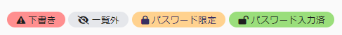
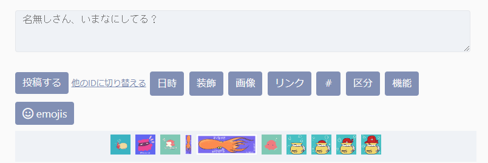
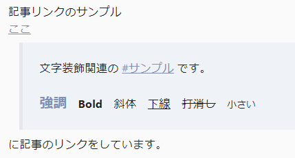

## 概要
たこつぼくらぶ にて配布しているてがろぐスキンです。
シンプルなタブ表示のスキン。
最低限の装飾しかしていないので、いい感じにカスタマイズして使ってください。

### 機能
- ダークモード切り替え
- Twitter(X)へのURL共有
- カスタム絵文字リストをスキン側で表示・コード挿入
- 記事をIDでリンクした場合、引用として表示

てがろぐ Ver 4.1.3（β版）で確認しています。

## 配布
GitHubで配布しています。
[こちらから](https://github.com/10rin0/skin-hujitubo)ダウンロードしてください。

## デモ・サンプル
詳しくは[こちらのデモ](https://takotubo.10rino.net/demo/tegalog.cgi?skin=skin-hujitubo)をご覧ください。

投稿の状態で付与されるラベルのサンプル

[下げる投稿のデモ](https://takotubo.10rino.net/demo/tegalog.cgi?skin=skin-hujitubo&postid=16)
[鍵付き投稿のデモ](https://takotubo.10rino.net/demo/tegalog.cgi?skin=skin-hujitubo&postid=6)

また、こういう感じで絵文字リストをクイック投稿フォームの下に入れられます。

記事のIDでリンクをした場合、リンクの直後に改行して、任意の文字数分、引用として表示されます。

なお、この機能自体はパーツとしてソースを公開しています。
[詳細はこちら](/tegalog/パーツ/quote/)

## 内容
- skin-cover.html (外側スキン)
- skin-onelog.html (内側スキン)
- get_cemoji.php (カスタム絵文字をスキン側に一覧表示するphp)
- hujitubo.png (サンプル用のアイコン画像)
- style (フォルダ)
    - color.css (カラー変更用)
    - tegalog.css (全体のCSS)
- README.md (これ)
- LISENCE
- .gitattributes（削除してOK）

## 使い方
zipをダウンロードして解凍（展開）し、必要なものをアップロードしてご使用ください。
スキンの適用方法そのものはてがろぐ公式マニュアルをご覧ください。

改変や、ファイルの置き場所を変更する…などはご自由に行っていただいて結構ですが、
相対パスで指定している部分のリンク切れにご注意ください。

使用にあたり、下記の必須・任意箇所の変更をお願いいたします。

### get_cemoji.php（カスタム絵文字表示用）※変更必須
スキン側にカスタム絵文字の一覧を持ってくるためのファイルです。
カスタム絵文字のアイコンを押すと、絵文字コードがコピーされてクイック投稿フォーム内に挿入できます。
#### 必須設定箇所
get_cemoji.phpの下記の箇所を書き換えてください。

3行目`$allowedDomain = 'https://example.com';`を適宜自分のサイトアドレスに変更してください。
`https://example.com/tegalog/tegalog.cgi`のように設置していても、設定するのは`https://example.com`で動作します。

13行目`$imgDir = '../emoji/';`を、**phpからの絵文字フォルダの相対パス**に変更してください。

#### 任意変更箇所
※get_cemoji.phpの置き場所を相対パスで指定しています。
置き場所を変更した場合は、**skin-cover.html　182行目**を変更してください。

例）phpをcgi本体と同じフォルダに置いた場合  
`url: 'skin-hujitubo/get_cemoji.php',`  
↓  
`url: 'get_cemoji.php',`に変更

また、193行目`var imgSrc = 'emoji/'`も必要な場合は変更してください。

上記のphpのファイル・スクリプトだけ使っても大丈夫です！
別のスキンに組み込む場合は、CSSをなんかいい感じに使いたいスキンに合わせてください。

この機能の装飾はtegalog.cssの599～655行目にあります。

### skin-cover.htmlの変更箇所（任意）
18行目　ファビコンのパスは例として入れているので、適宜置き換えてください。

39行目　アイコンの画像パスは、**tegalog.cgiからの相対パス**に置き換えてください。
サンプルとして使っている画像は、たこつぼくらぶがAdobe Expressにて、フリー素材のみで作成した画像です。
そのまま使っても問題はありませんが、たこつぼくらぶの名前が入っているので非推奨です。（ご自身の好きなアイコン画像を使ってほしいです！）

59～110行目（タブ部分）HTML・CSSの知識がある場合、入れ替えて使ってかまいません。
（変更する人向け：Javascriptなし、HTMLとCSSのみで作っています。HTML、CSSをぞれぞれ変更してください。）

95～109行目（最後のタブ）色々入れているので好きに削除したり追加したりしてください。

114行目～118行目　ページナビゲーションです。
HTMLは変更する必要はないのですが、cgi側の設定で、
「管理画面」→「設定」→「ページ」→「ナビゲーションリンクの表示」にて、「前後ページ移動リンク間の境界記号」を削除するといい感じになります。

126～129行目　一番上に固定表示されるメニューの左側部分です。
使わない表示モードは消しておいてください。

144行目　注意事項や簡単な案内などを書いてください。要らなかったら消してください。

147行目　`Copyright [[FREE:TITLE:MAIN]] [[INFO:LASTUPDATE:Y]].`とあるので、
適宜自分のサイト名や管理人の名前などに置き換えて使ってください。
今は例としててがろぐタイトルや最終更新年が入るようになっていますが、
メインサイト等で使っている表示に合わせるのがいいと思います。
そのものが不要な場合、削除してかまいません。

345行目　てがろぐの基本設定であるLIGHTBOXを読み込んでいます。他のプログラムを使っている場合は置き換えてください。

その他、スクリプトの読み込みやそれらの権利表記の記載は、使わない場合は削除してかまいませんが、よくわからなかったらそのままにしておいてください。

### skin-onelog.htmlの変更箇所
5～25行目　条件を限定した投稿（鍵つき、固定投稿など）につくラベルの設定箇所です。
文言やアイコンはお好みで変更してください。

36行目　投稿日時を表示するタグです。[公式マニュアル](https://www.nishishi.com/cgi/tegalog/custom/#customizeinfo-dateformat)を参照して変更してください。
相対時間（[[DATE:A]]）にするとTwitterっぽくなります。

53～65行目　SNS共有用のボタンです。お好みで追加したりしてください。
プレーンテキストで出力する必要があるため、 `[[COMMENT:TEXT:〇〇]] `または`[[COMMENT:TITLE:〇〇]]` を使う必要があることに注意してください。
TEXTタグだと画像がある場合（画像省略）と出力されるので、TITLEタグがおすすめです。  
X(twitter)に共有する場合、URLと本文で140字を超えないように注意してください。

### color.css
カラーリングを変更するCSSです。
配色を変更したいときはここを変更してください。

## スキンのライセンス
MIT License

## 各種使用ライブラリなどのライセンス
### てがろぐ
- 使用CGI
- https://www.nishishi.com/cgi/tegalog/
- [CGI使用条件（ライセンス）](https://www.nishishi.com/cgi/tegalog/#license)

### new.css
- CSSフレームワーク
- 全体のスタイルシートとして使用
- https://newcss.ne
- [MIT License](https://github.com/xz/new.css/blob/master/LICENSE)

### Font Awesome
- アイコンフォント
- 各種アイコンに使用
- https://fontawesome.com
- [Font Awesome Free License](https://fontawesome.com/license/free)

### clipboard.js
- テキストをコピーできるスクリプト
- URLのコピーボタンに使用
- https://clipboardjs.com
- [MIT License](https://github.com/zenorocha/clipboard.js/blob/master/LICENSE)