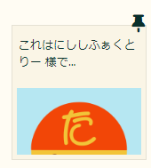
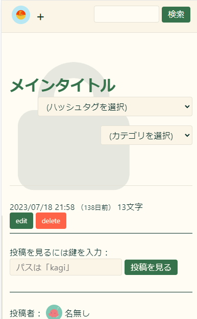
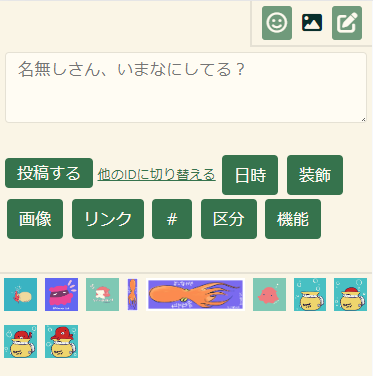
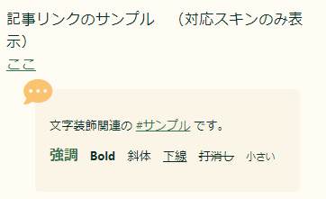

## 概要
たこつぼくらぶ にて配布しているてがろぐスキンです。 
一覧表示だと付箋っぽい表示 ~~（Scrapbox意識）~~ のスキン、
単独表示だとブログっぽい表示のスキンに切り替えられます。

### 機能
- 一覧と単独表示で、見た目を変更
- ダークモード切り替え
- Twitter(X)へのURL共有
- カスタム絵文字リストや画像管理画面をスキン側で表示
- 記事をIDでリンクした場合、引用として表示

てがろぐバージョンはVer 4.1.4 beta版で確認しています。

:::caution
【注意事項】  
一部**Ver 4.1.4**以降で使用できる`[[IF(条件): ～中身～ :IF]]`、`[[USERINTRO]] `や`[[USERINTRO]]`を使用していますので、
対応バージョンでご利用いただくか、該当部分を変更してご利用ください。

CSSで、一部`:has()`を使用しています。[一部のブラウザ](https://caniuse.com/css-has)では正常に動作しない可能性がありますのでご注意ください。
（全体のスクロールの制御に使用しています。効かなくても正直問題ない範囲です）
:::
名前の由来はマツバガイです。

## 配布
GitHubで配布しています。
[こちらから](https://github.com/10rin0/skin-matuba)ダウンロードしてください。

## デモ・サンプル
詳しくは[こちらのデモ](https://takotubo.10rino.net/demo/tegalog.cgi?skin=skin-matuba)をご覧ください。

固定投稿は、一覧にしたときにピンで刺したようなアイコンがつきます。

[鍵付きの投稿](https://takotubo.10rino.net/demo/tegalog.cgi?skin=skin-matuba&postid=6)は背景に鍵のアイコンがつきます。

右下のクイック投稿フォームを開くと、絵文字と画像の管理画面が開けます。

記事のIDでリンクをした場合、リンクの直後に改行して、任意の文字数分、引用として表示されます。

なお、この機能自体はパーツとしてソースを公開しています。
[詳細はこちら](/tegalog/パーツ/quote/)

## 内容
- skin-cover.html (外側スキン)
- skin-onelog.html (内側スキン)
- get_cemoji.php (カスタム絵文字をスキン側に一覧表示するphp)
- matuba.png (サンプル画像)
- style (フォルダ)
    - color.css (カラー変更用)
    - tegalog.css (全体のCSS)
    - zindex.css (表示の重なりの順位をリストアップ)
- README.md (これ)
- LISENCE
- .gitattributes（削除してください）

## 使い方
zipをダウンロードして解凍（展開）し、必要なものをアップロードしてご使用ください。 スキンの適用方法そのものはてがろぐ公式マニュアルをご覧ください。

改変や、ファイルの置き場所を変更する…などはご自由に行っていただいて結構ですが、 相対パスで指定している部分のリンク切れにご注意ください。

使用にあたり、下記の必須・任意箇所の変更をお願いいたします。

### get_cemoji.php（カスタム絵文字表示用）※変更必須
スキン側にカスタム絵文字の一覧を持ってくるためのファイルです。
カスタム絵文字のアイコンを押すと、絵文字コードがコピーされてクイック投稿フォーム内に挿入できます。

#### 必須設定箇所
get_cemoji.phpの下記の箇所を書き換えてください。

3行目`$allowedDomain = 'https://example.com';`を適宜自分のサイトアドレスに変更してください。
`https://example.com/tegalog/tegalog.cgi`のように設置していても、設定するのは`https://example.com`で動作します。

13行目`$imgDir = '../emoji/';`を、**phpからの絵文字フォルダの相対パス**に変更してください。

#### 任意変更箇所
※get_cemoji.phpの置き場所を相対パスで指定しています。
置き場所を変更した場合は、**skin-cover.html　277行目**を変更してください。

例）phpをcgi本体と同じフォルダに置いた場合  
`url: 'skin-matuba/get_cemoji.php',`  
↓  
`url: 'get_cemoji.php',`に変更

また、288行目`var imgSrc = 'emoji/'`も必要な場合は変更してください。

上記のphpのファイル・スクリプトだけ使っても大丈夫です！
別のスキンに組み込む場合は、CSSをなんかいい感じに使いたいスキンに合わせてください。

この機能の装飾はtegalog.cssの785～926行目にあります。

### skin-cover.htmlの変更箇所（任意）
17行目　ファビコンのパスは例として入れているので、適宜置き換えてください。

40行目　アイコンの画像パスは、**tegalog.cgiからの相対パス**に置き換えてください。
サンプルとして使っている画像は、たこつぼくらぶがAdobe Expressにて、フリー素材のみで作成した画像です。
そのまま使っても問題はありませんが、たこつぼくらぶの名前が入っているので非推奨です。（ご自身の好きな画像を使ってほしいです！）

49～90行目　グループごとに`<ul>`で囲んでください。
間に境界線を引いて見やすくなります。好きに削除したり追加したりしてください。

121行目～154行目　好きに削除したり追加したりしてください。
FlexBoxでデザインしているので、まとまり毎に`
`で囲む必要があります。

104行目、113行目　ifタグを使っていますのでご注意ください。（最新β版対応）

160行目　`Copyright [[FREE:TITLE:MAIN]] [[INFO:LASTUPDATE:Y]].`とあるので、
適宜自分のサイト名や管理人の名前などに置き換えて使ってください。
今は例としててがろぐタイトルや最終更新年が入るようになっていますが、
メインサイト等で使っている表示に合わせるのがいいと思います。
そのものが不要な場合、削除してかまいません。

383行目　てがろぐの基本設定であるLIGHTBOXを読み込んでいます。他のプログラムを使っている場合は置き換えてください。

その他、スクリプトの読み込みやそれらの権利表記の記載は、使わない場合は削除してかまいませんが、よくわからなかったらそのままにしておいてください。

### skin-onelog.htmlの変更箇所（任意）
全体的にIFタグで表示を切り替えていますのでご注意ください！

13行目　投稿に画像が一枚も含まれないとき、表示されるダミー画像です。
tegalog.cgiからの相対リンクで指定してください。

25～26行目　条件を限定した投稿（鍵つき、下書きなど）につくラベルの設定箇所です。
文言やアイコンはお好みで変更してください。

50～64行目　SNS共有用のボタンです。お好みで追加したりしてください。
プレーンテキストで出力する必要があるため、 `[[COMMENT:TEXT:〇〇]] `または`[[COMMENT:TITLE:〇〇]]` を使う必要があることに注意してください。
TEXTタグだと画像がある場合（画像省略）と出力されるので、TITLEタグがおすすめです。  
X(twitter)に共有する場合、URLと本文で140字を超えないように注意してください。

## ライセンス
MIT License

## 各種使用ライブラリなどのライセンス
### てがろぐ
- 使用CGI
- https://www.nishishi.com/cgi/tegalog/
- [CGI使用条件（ライセンス）](https://www.nishishi.com/cgi/tegalog/#license)

### Normalize.css
- リセットCSS
- http://necolas.github.io/normalize.css
- [MIT License](https://github.com/necolas/normalize.css/blob/master/LICENSE.md)

### new.css
- クラスレスCSSフレームワーク
- 全体のスタイルシートとして使用
- https://newcss.net
- [MIT License](https://github.com/xz/new.css/blob/master/LICENSE)

### Font Awesome
- アイコンフォント
- 各種アイコンに使用
- https://fontawesome.com
- [Font Awesome Free License](https://fontawesome.com/license/free)

### clipboard.js
- テキストをコピーできるスクリプト
- URLのコピーボタンに使用
- https://clipboardjs.com
- [MIT License](https://github.com/zenorocha/clipboard.js/blob/master/LICENSE)