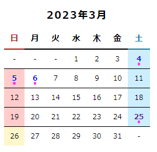

## 概要
てがろぐの独自タグ`[[CALENDAR]]`で出力されるHTMLを装飾するパーツCSS
土日は文字色・背景色が変化
今日の日付の背景色が変化
投稿した日はドットマークがつく
確認バージョン：てがろぐ4.0.3


## ライセンス
CC0 で配布します。
これはこのパーツスキンについてのライセンスであり、てがろぐの使用条件 はにししふぁくとりー様に従ってください。

## 使用方法
実際にCSSを適用したカレンダーは下の画像の通りです。

自動で出力されるクラスで装飾を指定しているので、ユーザー側でクラスを追加したりしなくても大丈夫です。
`[[CALENDAR]]`タグの挿入→CSSに下記のコードをコピペでOK！

## コード
コピー＆ペーストしてご利用ください。
```css
/*----------カレンダー要素全体----------*/
.calendar {
    box-sizing: border-box;
    width: 250px; /*横幅*/
    border-collapse: collapse;
    text-align: center;
    font-size: 12px;
    line-height: 2.5;
}

/*-----投稿のある日の設定-----*/
.calendar a {
    position: relative;
    display: inline-block;
    width: 100%;
    text-decoration: none; /*リンクの下線を消す*/
    font-weight: bold; /*太字にする*/
}

/*ドットマークを付ける*/
.calendar a::after {
    position: absolute;
    top: calc(50% + 0.5em);
    left: calc(50% - 0.2em);
    display: block;
    width: 0.4em;
    height: 0.4em;
    border-radius: 50%;
    background-color: hsl(300, 100%, 60%); /*ここで色を変更*/
    content: "";
}

/*-----●●年●月の部分-----*/
.calendar caption {
    text-align: center;
    letter-spacing: 2px;
    font-weight: bold;
    font-size: 1.4em;
}

/*-----曜日の見出し行-----*/
.calendar tr.daysofweek th {
    border-bottom: 2px solid; /*曜日名と日付セルの間の境界線*/
    text-align: center;
    font-size: 1.2em;
    line-height: 2.3;
}

/*-----カレンダー内の境界線-----*/
/*1週間ごとの行の境界線*/
.calendar tr {
    border-bottom: 1px solid; 
}

/*最後の週は境界線を消す*/
.calendar tr:last-child {
    border-bottom: none;
}


/*-----日付セルごとの設定-----*/
.calendar td {
    vertical-align: middle;
}


/*-----土曜日の設定-----*/
/*曜日名の色*/
.calendar th:nth-child(7) {
    color: hsl(200, 70%, 40%);
}

/*日付の背景色*/
.calendar tr td.sat {
    background-color: hsl(200, 100%, 90%);
}

/*-----日曜日の設定-----*/
/*曜日名の色*/
.calendar th:nth-child(1) {
    color: hsl(0, 70%, 40%);
}

/*日付の背景色*/
.calendar tr td.sun {
    background-color: hsl(0, 100%, 90%);
}

/*-----今日の日付-----*/
/*日付の背景色*/
.calendar tr td.today {
    background-color: hsl(50, 100%, 90%);
}

/*-----空の日付に「-」を入れる-----*/
.calendar td.empty::after {
    content: "-";
}
```
色はすべてhslで指定しています。

お好みでカラーコードなりRGBなどに変更してください。
テキストやリンクの色は、お使いのスキンの設定を継承したほうがいいかな？と思い、設定していません。
デザイン上見えづらい……など、必要があれば追加したほうがいいです。

## 参考リンク
てがろぐ公式 [▼カレンダー表示の装飾方法](https://www.nishishi.com/cgi/tegalog/custom/#customizecss-calendar)