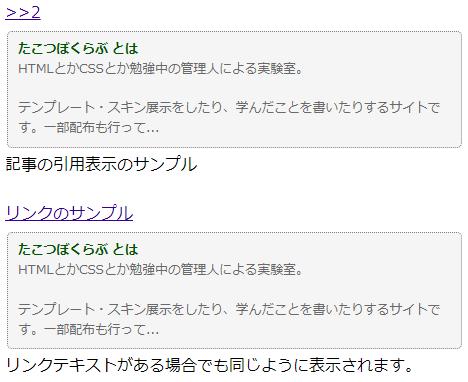

## 概要
- 記事リンクで、リンク先の記事を引用表示する
- jQueryを使用
- htmlまたはプレーンテキストで表示
- AI生成のコードのため、使用は自己責任で

## ライセンス
CC0で配布します。
コメントは一部おくとが書いていますが、ソース自体はChatGPTです。
（動作はvivaldi、Edge、safari(iPhone)で確認しています。）
配布というかソースはご自由にコピペ可で公開、くらいのニュアンスです。


## 詳細
てがろぐの独自記法で任意の記事番号リンクを記述した場合、その記事の本文がリンク直後に挿入されます。
独自記法は`>123`　`[>123:リンクテキスト]`のような書き方でもどちらでも使えます。
自己言及が多い方、掲示板のように使用している方におすすめです。

htmlをそのまま表示するか、プレーンテキストで表示するかの２つの方法があります。

### htmlで表示する場合
改行、文字装飾を行ったものやリンクなどもそのまま表示されます。

画像などもそのまま出力されますが、文字数の設定によってはソースが不十分になり、完全に表示されない場合があります。

例）記事内に画像を挿入すると、figure 、a、imgタグなどが
セットで出力されますが、`<figure class="embeddedpictbox"> …`くらいで
文字数制限が来た場合、imgタグまでたどり着いていないので、
結果画像が出力されない…みたいな状況になります。

だいたい350字くらいで画像が表示されますが、
lightboxは使えないみたいなので、そもそも記事本文先頭が画像の記事は
リンクしないのがおすすめです。


### プレーンテキストで表示される場合
改行や装飾は無視されます。
本文の先頭にテキストがない場合、画像を無視して一番最初の文章が表示されます。

本文先頭の画像にキャプションがあるときはキャプションを表示します。テキストで表示できる文章が何もない場合は何も表示されません。


複数記事リンクは対応していません。その場合、最後の記事の内容が引用されます。

## 使い方

### skin-onelog.htmlに記述（されているか確認）する内容
てがろぐの記事本文を表示するタグ`[[COMMENT]]`が、`<div class="comment">`で囲まれているか確認してください。

例）
```html
<div class="comment">[[COMMENT]]</div>
```
クラス名自体は異なっていても大丈夫ですが、その場合は続きの部分で指定している内容を書き換える必要がありますので、注意してください。


### skin-cover.htmlに記述する内容
jQueryを使用するため、skin-cover.htmlのbodyタグ内に、CDNなどでスクリプトを読み込んでください。
ソースは[公式のページ](https://releases.jquery.com)などから取得してください。

例）
```html
<script src="https://code.jquery.com/jquery-3.7.0.min.js"></script>
```

てがろぐの独自タグ`[[JS:LIGHTBOX:JQ]]`でjQueryを読み込んでいる場合は置き換えてください。[^1]

続いて、下記の内容を追加します。

```html
<script>
   $(document).ready(function () {
      // 記事リンクに標準で付加されているクラスpostidlinkをトリガーにする
      $('.postidlink').each(function (index) {
         var linkElement = $(this);
         // そのあとに<div class="qpost-番号">を加える。
         // qpost=QuotePostです。 クラス部分はお好みで変更
         var newDivElement = $('<div>').addClass('qpost-' + (index + 1));

         // リンク要素の後に新しい div 要素を挿入
         linkElement.after(newDivElement);

         var linkURL = linkElement.attr('href');

         $.ajax({
            url: linkURL,
            type: 'GET',
            dataType: 'html',
            success: function (html) {
               var tempDiv = $('<div>').html(html);

               // リンク先から取得した内容から<div class="comment">のテキストを抽出
               // comment以外のクラス指定の場合はfind('.comment')の部分を書き換え
               // プレーンテキストで表示する場合は.html()を.text()に書き換え
               var commentContent = tempDiv.find('.comment').html();

               // 加える文字列を制限して100文字までに切り詰め
               // 省略する場合は省略記号...を追加
               var maxLength = 100;
               var limitedContent = commentContent.length > maxLength ?
                  commentContent.substring(0, maxLength) + '...' :
                  commentContent;

               // 新しい div 要素にリンク先の内容を追加
               // プレーンテキストで表示する場合は.html(略)を.text(略)に書き換え
               newDivElement.html(limitedContent);
            },
         });
      });
   });
</script>
```
上記はhtmlの内容を表示します。プレーンテキストで表示したい場合は、コメントに記載の通りに書き換えてください。
また、`<div class="comment">`で情報を取得している部分がありますので、`[[COMMENT]]`を別のクラスで囲んでいる場合は、そのクラス名に正しく書き換えてください。

### CSS
引用部分を装飾するCSSを追加してください。

（例）
```css
a.postidlink + div {
   margin: 5px 2px;
   padding: 8px 10px;
   background-color: whitesmoke;
   color: dimgray;
   font-size: 0.8em;
   border: dotted 1.5px gray;
   border-radius: 5px;
}
```
上記のCSSは例なので、お好みで装飾を加えてください。
このままコピペで使っていただいても大丈夫です。（その場合も使用報告等不要です）

## 参考リンクなど
今回作成にあたって、10press（えむおか様）の記事を参考にさせていただきました。
記事のタイトル部分を[head内のtitleに記載する方法](https://10prs.com/view/57)や、[前後ページの移動リンクに置き換える方法](https://10prs.com/view/58)など、ページの表示に役立つ情報が載っていますので、ぜひご覧ください。
（本文一行目をクラスの指定など、異なる部分が多くあります。ご利用状況に合わせて、必要なものは違うかと思いますので、そのあたりは自己判断＆自己解決していただければ…。）
※当記事で公開している情報に関しての10press（えむおか様）へのお問い合わせはやめてください。

また、今回の内容と別の表示をしたい、という方は、配布されている[CMSkin](https://10prs.com/web-tips/tegalog/download/CMSkin)を
CMSkinはトップページ・作品展示・コメント返信…などでさまざまなスキンを使い分けることができ、また記事の引用以外にも多くの独自実装があります。

小さいパーツとして記事の引用を使用する方は、こちらのソースをご利用くださればと思います。
どんなスキンにも使えるパーツがほしくて作りました。
（将来えむおか様がパーツとして配布・ソースを公開される場合はそちらを使われたほうがいいと思います。多分私もそうします）

## 注釈

[^1]:独自タグ`[[JS:LIGHTBOX:JQ]]`について
上記記事でも言及されていますが、`[[JS:LIGHTBOX:JQ]]`ページ内に画像が表示される場合のみ読み込むそうです。
今回の場合ですと、記事内に画像がない場合、正常に機能しなくなります。
詳しくはてがろぐ公式（にしし様）に解説がありますので、ご確認ください。
https://www.nishishi.org/testground/tegalog/tegalog.cgi?postid=3295